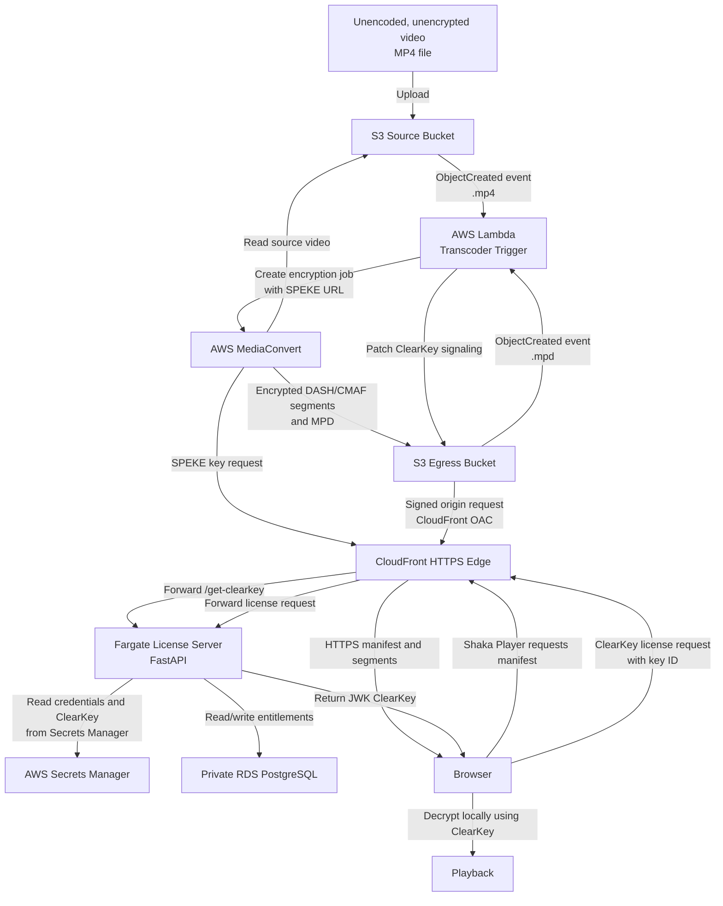

# AWS ClearKey Video Pipeline

This project demonstrates an AWS video workflow that accepts an unencoded, unencrypted MP4, encrypts it with AWS MediaConvert, and delivers it for browser playback using Shaka Player and ClearKey DRM.

## Workflow



See [workflow.md](workflow.md) for the step-by-step workflow and security boundaries.

## Workflow Summary

1. Upload an unencoded, unencrypted MP4 to the source S3 bucket.
2. S3 triggers the Lambda transcoder.
3. Lambda starts an AWS MediaConvert encryption job.
4. MediaConvert requests encryption keys through the SPEKE license endpoint.
5. MediaConvert writes encrypted DASH/CMAF output to the egress S3 bucket.
6. CloudFront serves the encrypted manifest and segments over HTTPS.
7. Shaka Player requests the ClearKey license.
8. The browser decrypts the stream locally and plays it.

## MFA and Terraform Deployment Role

The operator signs in with an IAM user that has MFA enabled, then assumes a separate `TerraformDeploymentRole`. The role trust policy should allow the intended user and require MFA. IAM roles do not have MFA devices assigned directly; the MFA device belongs to the user who assumes the role.

The deployment role is used only to provision and update the infrastructure. The deployed services use their own runtime roles:

- MediaConvert uses its execution role to read source media and write encrypted output.
- Lambda uses its execution role to start MediaConvert jobs and process S3 events.
- ECS uses an execution role for image/log/secret access and a task role for application S3 access.
- CloudFront uses Origin Access Control to access the private egress bucket.

The deployment role should have only the Terraform, ECR, and ECS permissions needed for this project. Its `iam:PassRole` permissions should be limited to the project runtime roles and restricted with `iam:PassedToService` conditions.

## Running the Setup Script

The setup script obtains one temporary MFA-backed session and reuses it for Terraform, ECR, and ECS commands. It does not write temporary AWS credentials to disk. The account, role, MFA device, region, and project name are supplied as named options:

```bash
python3 setup.py \
    --account-id <AWS_ACCOUNT_ID> \
    --role-name <TERRAFORM_ROLE_NAME> \
    --mfa-device-name <MFA_DEVICE_NAME>
```

The script prompts securely for the MFA code, database password, and 32-character hexadecimal ClearKey value. Secrets can also be supplied with `--db-password` and `--clear-key-value`, but secure prompts are recommended because command-line arguments can be saved in shell history or visible in process listings.

The setup sequence is:

1. Assume the Terraform deployment role with MFA.
2. Apply the Terraform configuration.
3. Read Terraform outputs for the buckets, database, ECR repository, and endpoints.
4. Log in to ECR, build the application image, and push it.
5. Force an ECS service deployment.
6. Run the database table initialization task.

For Terraform-only operations, use `terraform_mfa.py` with the same named environment settings, or run `setup.py` for the complete deployment workflow. Never commit passwords, ClearKey values, temporary credentials, or Terraform state files.

## Security Notes

- The source bucket stores the unencrypted upload temporarily.
- The egress bucket is private and is accessed through CloudFront Origin Access Control.
- Database credentials and ClearKey values are supplied through AWS Secrets Manager.
- Do not commit Terraform state files, generated ZIP files, or local environment files.
- Tear down the AWS deployment when it is not in use to avoid unnecessary costs and exposure.
