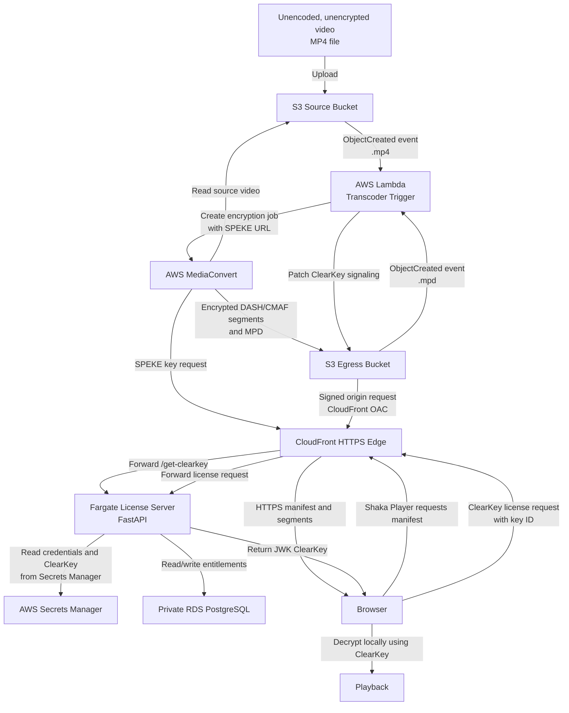

# AWS ClearKey Video Pipeline

This project demonstrates an AWS video workflow that accepts an unencoded, unencrypted MP4, encrypts it with AWS MediaConvert, and delivers it for browser playback using Shaka Player and ClearKey DRM.

## Workflow

See [workflow.md](workflow.md) for the step-by-step workflow and security boundaries.

## Workflow Summary

1. Upload an unencoded, unencrypted MP4 to the source S3 bucket.
2. S3 triggers the Lambda transcoder.
3. Lambda starts an AWS MediaConvert encryption job.
4. MediaConvert requests encryption keys through the SPEKE license endpoint.
5. MediaConvert writes encrypted DASH/CMAF output to the egress S3 bucket.
6. CloudFront serves the encrypted manifest and segments over HTTPS.
7. Shaka Player requests the ClearKey license.
8. The browser decrypts the stream locally and plays it.

## Security Notes

- The source bucket stores the unencrypted upload temporarily.
- The egress bucket is private and is accessed through CloudFront Origin Access Control.
- Database credentials and ClearKey values are supplied through AWS Secrets Manager.
- Do not commit Terraform state files, generated ZIP files, or local environment files.
- Tear down the AWS deployment when it is not in use to avoid unnecessary costs and exposure.
