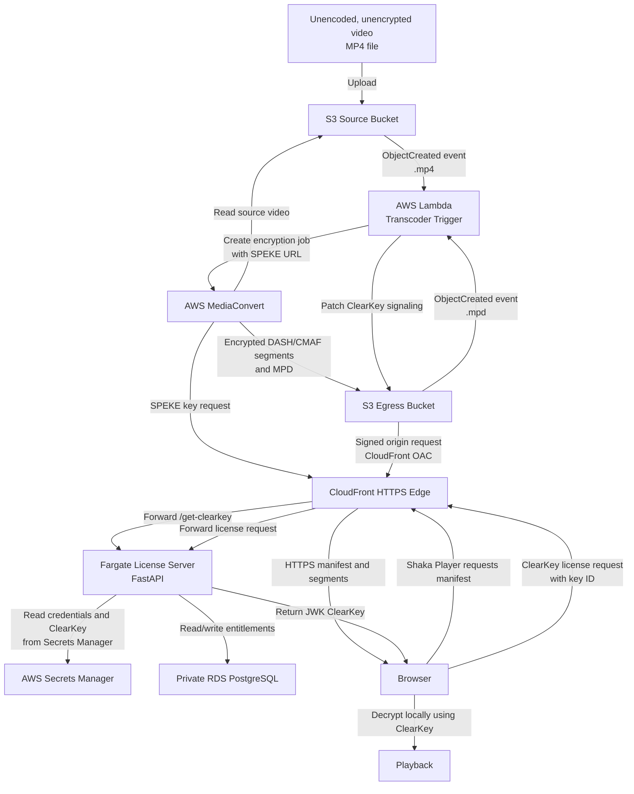

# Video Encryption and Playback Workflow

This workflow shows how an unencoded, unencrypted MP4 is uploaded, encrypted by AWS MediaConvert, served through CloudFront, and played back in the browser with Shaka Player.

## Workflow

1. An unencoded, unencrypted MP4 is uploaded to the source S3 bucket.
2. S3 triggers the Lambda transcoder.
3. Lambda starts an AWS MediaConvert job.
4. MediaConvert reads the source file and requests encryption keys through the SPEKE license endpoint.
5. The license service retrieves ClearKey data from Secrets Manager and RDS.
6. MediaConvert writes encrypted DASH/CMAF output to the egress S3 bucket.
7. Lambda patches the generated manifest with ClearKey signaling.
8. CloudFront serves the manifest and encrypted segments over HTTPS.
9. Shaka Player requests the ClearKey license using the media key ID.
10. The browser decrypts the encrypted stream locally and plays it.

## Security Boundaries

- The source S3 bucket stores the uploaded unencrypted input.
- MediaConvert performs the encryption before delivery output is published.
- The egress S3 bucket is private and is accessed through CloudFront Origin Access Control.
- Database credentials and ClearKey values are supplied through AWS Secrets Manager.
- The browser receives encrypted media and a ClearKey license response, then performs local decryption.
